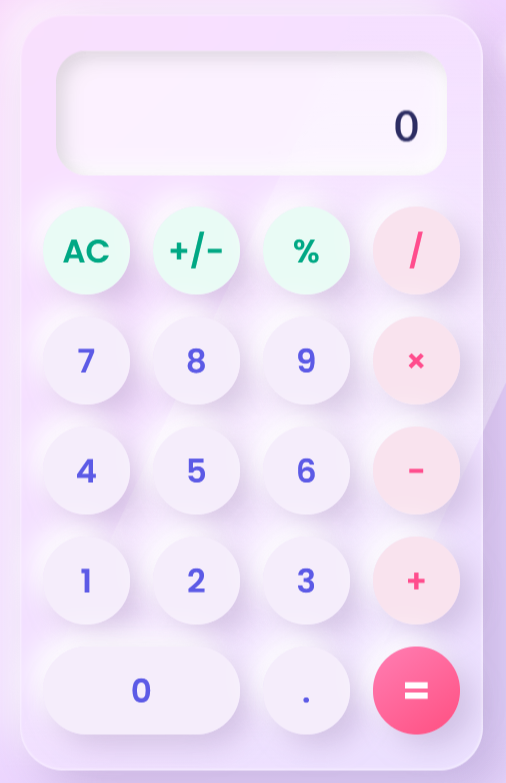
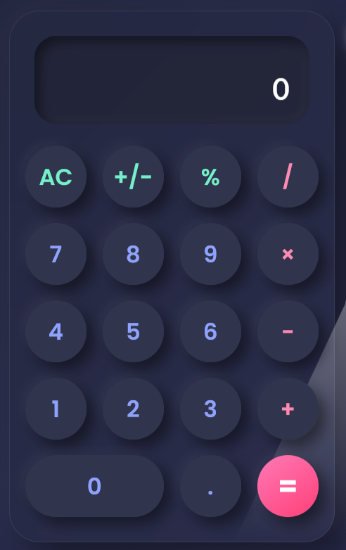

# 🌙 NovaCalc

<p>
A beautifully crafted glassmorphism calculator built using <b>HTML</b>, <b>CSS</b>, and <b>JavaScript</b>. NovaCalc combines elegant neumorphic design, smooth animations, responsive layout, and a seamless dark/light mode experience into a modern web application.
</p>


# 🚀 Live Demo

Experience NovaCalc directly in your browser without any installation.

**🔗 Live Demo:**
https://nova-calc-eta.vercel.app/


# ✨ Features

NovaCalc offers a modern calculator experience with an elegant user interface and smooth interactions.

### Key Features

* 🎨 Elegant Glassmorphism UI
* 💎 Premium Neumorphism Design
* 🌙 Dark & Light Theme Toggle
* 📱 Fully Responsive Layout
* ⚡ Smooth Button Animations
* 🌊 Ripple Click Effect
* ⌨️ Keyboard Support
* ➕ Addition, Subtraction, Multiplication & Division
* 📊 Percentage Calculation
* 🔄 Positive / Negative Toggle
* 💻 Modern & Minimal User Interface
* 🚀 Lightweight and Fast


# 📸 Screenshots

## ☀️ Light Theme

<p align="center">
  
</p>
<p align="center">
  <b><i>Figure 1: NovaCalc - Light Theme</i></b>
</p>


## 🌙 Dark Theme

<p align="center">
  
</p>
<p align="center">
  <b><i>Figure 2: NovaCalc - Dark Theme</i></b>
</p>


# 🛠️ Tech Stack

NovaCalc was developed using modern web technologies to provide a responsive, lightweight, and visually appealing user experience.

| **Technology**     | **Purpose**                                  |
| ------------------ | -------------------------------------------- |
| 🌐 HTML5           | Structure and Page Layout                    |
| 🎨 CSS3            | Styling, Glassmorphism & Neumorphism Effects |
| ⚡ JavaScript (ES6) | Calculator Logic and User Interaction        |
| 🚀 Vercel          | Deployment and Hosting                       |


# 📂 Project Structure

```text
NovaCalc
│
├── images
│   ├── light-theme.png
│   ├── dark-theme.png
│
├── index.html
├── style.css
├── script.js
└── README.md
```


# ⚙️ Installation

## 1️⃣ Clone the Repository

```bash
git clone https://github.com/yourusername/NovaCalc.git
```


## 2️⃣ Navigate to the Project Directory

```bash
cd NovaCalc
```


## 3️⃣ Run the Application

Simply open:

```text
index.html
```

using your preferred web browser.

No additional dependencies or installations are required.


# 🚀 Future Improvements

Future enhancements planned for NovaCalc include:

* 🧮 Scientific Calculator Mode
* 📜 Calculation History
* 💾 Memory Functions (M+, M-, MR)
* 🎨 Multiple UI Themes
* 📈 Graph Plotting
* 🎤 Voice Commands
* 🧠 Expression Evaluation
* 📱 Progressive Web App (PWA)
* 🌍 Multi-language Support


# 👩‍💻 Author

**Raga Sandhiya R**
